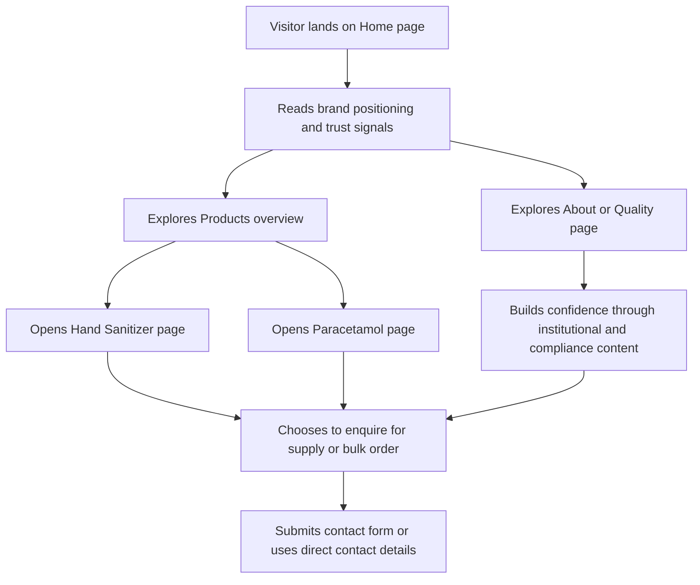

## 1. Product Overview
Sanjivani Pharma needs a professional, pharma-grade website that replaces a placeholder single-product page with a credible institutional presence for hospitals, clinics, distributors, and bulk buyers.
- The site must communicate trust through cooperative ownership, the 7 July 2021 R&D plant inauguration, GMP-oriented quality messaging, and clear product information for hand sanitizer and paracetamol.
- The business value is stronger institutional credibility, better lead capture for procurement enquiries, and a maintainable foundation for future products, updates, and certifications.

## 2. Core Features

### 2.1 User Roles
This is a public-facing marketing site, so no user role distinction is required in phase 1.

### 2.2 Feature Module
1. **Home page**: hero, institutional trust strip, product teaser cards, why-choose-us pillars, credibility section, enquiry call-to-action.
2. **About page**: R&D plant story, inauguration milestone, cooperative parent background, mission, manufacturing philosophy.
3. **Products overview page**: product cards, quick facts, category positioning, CTA to product detail pages.
4. **Hand Sanitizer product page**: alcohol concentration, protection messaging, usage guidance, pack-size block, compliance note, enquiry CTA.
5. **Paracetamol product page**: formulation overview, intended use statement, pack-size block, regulatory note, enquiry CTA.
6. **Quality & Certifications page**: GMP explanation, WHO alcohol-standard note, compliance-focused copy, claim disclaimer, imagery placeholders for certificates and plant visuals.
7. **Contact page**: enquiry form, bulk and institutional order messaging, address, phone/email, map embed, alternate contact methods.

### 2.3 Page Details
| Page Name | Module Name | Feature description |
|-----------|-------------|---------------------|
| Home | Hero section | Premium pharma hero with headline, tagline, trust-focused copy, and CTAs to products and contact |
| Home | Trust strip | Short institutional proof points such as R&D plant inauguration and cooperative backing |
| Home | Product teaser cards | Two flagship cards for sanitizer and paracetamol with summary specs and detail links |
| Home | Why Choose Us | Four icon-led pillars: pharma-grade quality, effective protection, skin-friendly formulation, trusted by professionals |
| Home | Credibility section | R&D plant story summary with date, dignitary mention, and link to About page |
| About | Milestone story | Detailed narrative of the 7 July 2021 inauguration and the division's role |
| About | Cooperative background | Parent organization context and institutional credibility messaging |
| About | Mission and quality philosophy | Clear positioning on safety, consistency, and responsible manufacturing |
| Products | Product listing | Overview grid with product summaries, use-case cues, and enquiry prompts |
| Hand Sanitizer | Product facts | Alcohol percentage, use context, features, pack-size placeholders, compliance note |
| Hand Sanitizer | Usage guidance | Practical usage section for hospitals, clinics, offices, and institutions |
| Paracetamol | Product facts | Formulation overview, use context, packaging placeholders, regulatory note |
| Quality & Certifications | Compliance explainer | Plain-language GMP and WHO-standard content presented as verifiable quality facts |
| Quality & Certifications | Certificate references | Structured placeholders for certification/license numbers once approved |
| Contact | Enquiry form | Structured lead form for procurement, distributor, or institutional interest |
| Contact | Contact information | Address, phone, email, map, and office-hour or response-expectation messaging |

## 3. Core Process
Visitors arrive from branded search, direct traffic, or referrals and must immediately understand that Sanjivani Pharma is not a generic sanitizer seller but a serious manufacturer backed by an established cooperative and a real R&D plant. From there, they either validate trust through the About and Quality pages or move directly into product details. Each core page should funnel toward a simple institutional enquiry flow, especially for hospitals, clinics, distributors, and bulk buyers.

## 4. User Interface Design

### 4.1 Design Style
- Primary color: deep medical teal or blue for authority and cleanliness
- Secondary color: clean white with slate/graphite neutrals for content density
- Accent color: muted green inspired by the cross-shield logo for CTAs and trust badges
- Button style: crisp rounded rectangles with restrained shadows and strong contrast
- Typography: a distinctive editorial display font for headings paired with a highly legible sans-serif for body content
- Layout style: desktop-first modular sections with strong hierarchy, structured grids, and restrained motion
- Icon style: simple line or duotone icons for quality, protection, skin-friendliness, and professional trust

### 4.2 Page Design Overview
| Page Name | Module Name | UI Elements |
|-----------|-------------|-------------|
| Home | Hero section | Product-forward image area, strong heading, calm clinical palette, subtle reveal animations |
| Home | Trust strip | Compact badges or stat tiles with inauguration date, cooperative heritage, and GMP/quality cues |
| Home | Product teaser cards | Premium cards with product highlights, pack placeholders, and quick CTA buttons |
| Home | Why Choose Us | Four-card icon section with concise proof-oriented copy |
| About | Milestone story | Timeline or narrative layout with dignitary and inauguration content |
| Products | Overview grid | Clean catalog layout with filtered or grouped product presentation if future items are added |
| Product pages | Facts and specification blocks | Specification cards, compliance notes, CTA panels, and image gallery slots |
| Quality & Certifications | Compliance storytelling | Layered content blocks mixing explanation, claims discipline, and certificate placeholders |
| Contact | Form and location | Two-column layout on desktop, stacked on mobile, with high-clarity form fields and map embed |

### 4.3 Responsiveness
- Desktop-first layout as the primary design direction, with careful mobile adaptation for semi-urban network conditions
- Mobile layouts should prioritize fast loading, tap-friendly CTAs, reduced motion, and compressed imagery
- Navigation should collapse cleanly without hiding key pages or enquiry access
- Performance budgets should keep the site usable on mid-range Android devices and slower mobile networks

### 4.4 Content and Compliance Guidance
- All GMP, WHO, and regulatory claims must be phrased as factual, supportable statements
- Certification or license numbers must appear only where approved for public disclosure
- Pack sizes and pricing should be modeled as optional fields so the site can support either public details or "Enquire for pricing"
- Real plant and product photography should be preferred, with clean temporary placeholders until approved assets arrive
