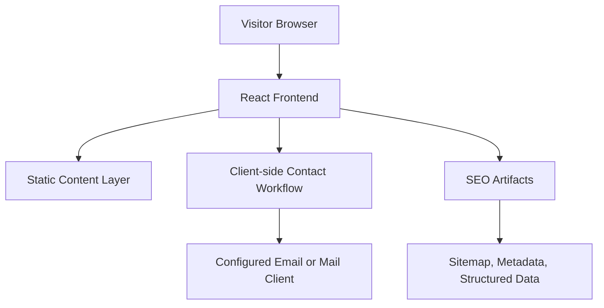
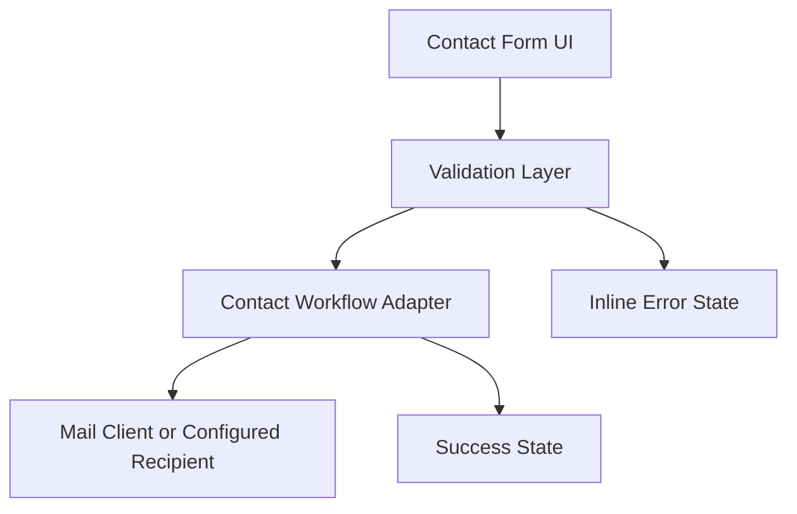
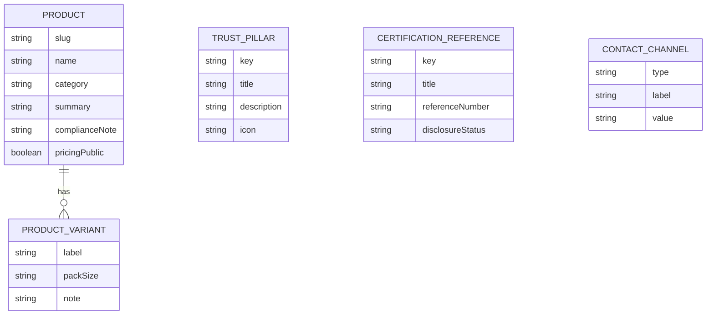

## 1. Architecture Design



This project should use a content-driven React architecture built with Vite for speed, straightforward deployment, and low maintenance. Product and trust content should live in structured local data files so staff-facing updates remain simple and future pages can be added without reworking the layout system. The contact experience should remain React-driven in phase 1, using client-side validation and a configurable enquiry handoff that can later be upgraded to a dedicated backend endpoint if needed.

## 2. Technology Description
- Frontend: React + TypeScript + Vite
- Styling: Tailwind CSS with design tokens stored as CSS variables
- Routing: React Router for page-level navigation
- State management: zustand only if shared UI state is needed
- Component strategy: reusable section, card, badge, CTA, and form primitives with page-specific composition
- Content source: local structured data in `content/` using TypeScript or JSON modules for products, certifications, and trust pillars
- Forms: React form with client-side validation and configurable mail handoff for phase 1
- Database: None in phase 1
- Media: optimized local assets in `public/` with room for future CMS migration
- Analytics: lightweight privacy-respecting analytics script, added only if approved
- Deployment target: static hosting or Vercel/Netlify-class deployment for the built frontend

## 3. Route Definitions
| Route | Purpose |
|-------|---------|
| / | Home page with brand positioning, product teasers, trust signals, and lead CTA |
| /about | Institutional background, R&D plant story, cooperative heritage, and mission |
| /products | Product overview page for current and future offerings |
| /products/hand-sanitizer | Detailed sanitizer product page with specs and enquiry CTA |
| /products/paracetamol | Detailed paracetamol product page with specs and enquiry CTA |
| /quality-certifications | GMP, WHO-standard explanation, and compliance-oriented trust content |
| /contact | Contact details, map, and lead-generation form |

## 4. API Definitions

### 4.1 Contact Enquiry Request
```ts
type EnquiryType = "bulk-order" | "institutional-procurement" | "distributor" | "general";

interface ContactEnquiryRequest {
  name: string;
  organization?: string;
  email: string;
  phone?: string;
  enquiryType: EnquiryType;
  productInterest?: "hand-sanitizer" | "paracetamol" | "both" | "other";
  message: string;
}
```

### 4.2 Contact Enquiry Response
```ts
interface ContactEnquiryResponse {
  success: boolean;
  message: string;
}
```

### 4.3 Endpoint Definition
| Method | Endpoint | Purpose |
|--------|----------|---------|
| Client-side | Contact form submit handler | Validates the enquiry form and hands off the enquiry through the configured contact workflow |

### 4.4 Validation Rules
- `name`, `email`, `enquiryType`, and `message` are required
- Email format must be validated client-side
- Input length must be capped to prevent abuse
- Honeypot or lightweight anti-spam protection should be included
- No medical advice or prescription workflow is part of this form

## 5. Server Architecture Diagram



## 6. Data Model

### 6.1 Data Model Definition


### 6.2 Content Structure Definition
```ts
interface ProductVariant {
  label: string;
  packSize?: string;
  note?: string;
}

interface ProductContent {
  slug: "hand-sanitizer" | "paracetamol";
  name: string;
  shortDescription: string;
  heroSummary: string;
  keyHighlights: string[];
  usageOrIndication: string[];
  complianceNote: string;
  pricingMode: "public" | "enquiry";
  variants: ProductVariant[];
}

interface TrustPillar {
  key: string;
  title: string;
  description: string;
  icon: string;
}

interface CertificationReference {
  key: string;
  title: string;
  referenceNumber?: string;
  disclosureStatus: "approved" | "withheld" | "pending-confirmation";
}
```

## 7. SEO and Discoverability Strategy
- Use page-specific document metadata for all public routes
- Generate `sitemap.xml` and `robots.txt` during the build or maintain them in `public/`
- Add Organization and LocalBusiness structured data with address and contact details
- Ensure all product and plant images have descriptive alt text
- Keep content indexable and avoid burying important brand facts inside client-only components

## 8. Performance and Accessibility Requirements
- Prefer static frontend delivery for all informational routes
- Optimize all images with responsive sizing and compressed formats
- Keep font loading limited to a small, intentional set
- Use semantic landmarks, accessible contrast, visible focus states, and keyboard-usable navigation
- Keep animations subtle and respect reduced-motion preferences

## 9. Implementation Notes
- Build the design system first inside the app as reusable primitives rather than one-off page markup
- Keep page-specific copy in structured content files so future product additions remain straightforward
- Reserve certificate references and pack-size arrays for easy future updates without changing page layouts
- Treat public compliance claims as content configuration, not hard-coded marketing copy
